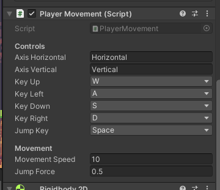
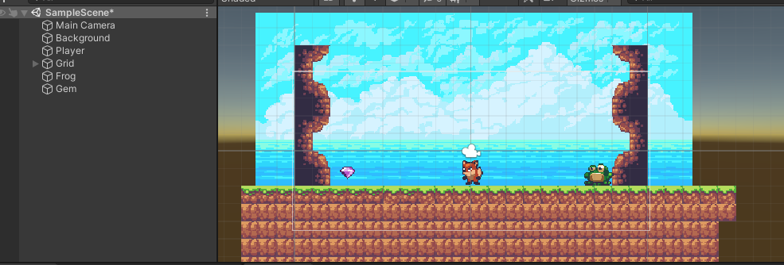

# Introducción a la programación de juegos 2D. Sprites.

## 1. Obtener assets que incorpores a tu proyecto: Sprites individuales y Atlas de Sprites.

Para este proyecto se han usado los sprites player, gem y frog, dentro del direction "Sunnyland". Se han descargado de la Asset Store.
Se tratan de sprite individuales para hacer las animaciones.

## 2. Incorporar los recursos del punto 1 en el proyecto y generar al menos 2 animaciones para uno de los personajes.

Se han generado las siguientes animaciones:
* Player:
    - Idle
    - Run
    - Land
    - Jump
    - Crouch
* Gem:
    - Idle
* Frog:
    - Idle
    - Jump
    - Land

### Player animator


### Gem animator


### Frog animator


## 3. Busca en el inspector de objetos la propiedad Flip y comprueba qué pasa al activarla desactivarla en alguno de los ejes.

Al usar el toggle flip el sprite se muestra en modo espejo. Podemos usar esta propiedad para posicionar nuestro sprite mirando a la derecha o izquierda respectivamente.

### Sin flip


### Con flip


## 4. Mover uno de los personajes con el eje horizontal virtual que definen las teclas de flechas.

Se ha creado [PlayerMovement.cs](Assets/Scripts/PlayerMovement.cs) para realizar esta función.



La lógica de movimiento se actualiza cada frame y se ejecuta en el método `FixedUpdate()`

```
    void FixedUpdate() {
        ProcessKeyBindings();
        UpdateAnimation();

        CalculateBoundingBox();

        MovePlayerHorizontally();
        MovePlayerVertically();
    }

    [...]

    void MovePlayerHorizontally() {
        if(speedH == 0.0f || isCrouching) {
            return;
        } 

        if(speedH > 0 && !CanMoveRight() || speedH < 0 && !CanMoveLeft()){
            Debug.Log("Cannot move!");
            return;
        }
        
        var position = this.transform.position;
        position.x = position.x + speedH * movementSpeed * Time.fixedDeltaTime;
        this.transform.position = position;
    }
```

## 5. Hacer saltar el personaje y cambiar de dirección cuando se pulsa la barra espaciadora.

En el mismo [PlayerMovement.cs](Assets/Scripts/PlayerMovement.cs) se maneja esta función.

```
    void MovePlayerVertically() {
        if(isJumpingButtonPressed && !isJumping && canJump){
            StartCoroutine(PerformJump());
        }

        if(speedV != 0.0f) {
            var position = this.transform.position;
            position.y = position.y + speedV * Time.fixedDeltaTime;
            this.transform.position = position;
        }
    }
```


## 6. Crear una animación para otro personaje, que se active cuando el jugador pulse la tecla x.

Se usa [GemAnimation.cs](Assets/Scripts/GemAnimation.cs) para realizar esta tarea.


## 7. Agregar un objeto que al estar el personaje a una distancia menor que un umbral se active una animación, por ejemplo explosión o cualquier otra que venga en el atlas de sprites.

Se usa [FrogAnimation.cs](Assets/Scripts/FrogAnimation.cs) y una referencia al jugador para calcular la distancia y ejecutar la animación.


## Resultado
Todos los elementos se ponen en la escena y se añaden los scripts correspondientes a cada gameobject 